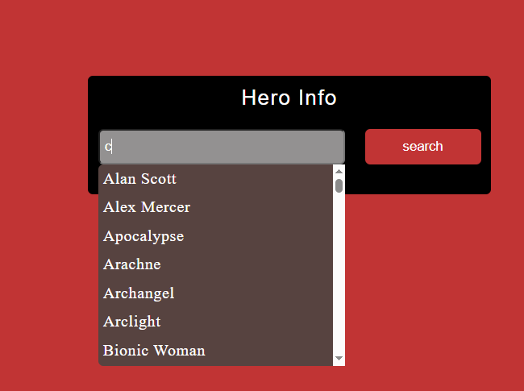
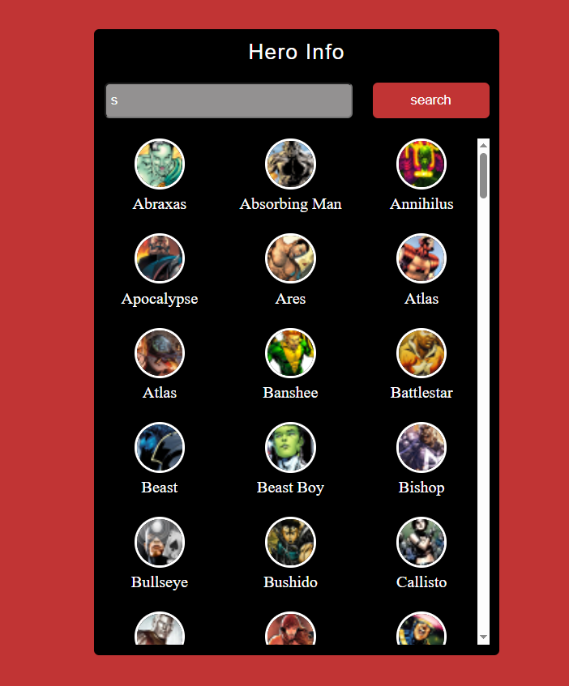

#online link https://zakarialol.github.io/search-movies-hero-by-name/
#🦸 Superhero Search App

A simple frontend project that allows users to search for superheroes and view their basic information using a public Superhero API.

This project was built to practice JavaScript fundamentals such as functions, arrays, async logic, and DOM manipulation.

---

## 🚀 Features

- 🔍 Search superheroes by name  
- 📄 Display hero information dynamically  
- ⚡ Fast and simple UI  
- 🧠 Beginner-friendly JavaScript logic  

---

## 🛠️ Built With

- HTML  
- CSS  
- JavaScript (Vanilla JS)  
- Superhero API (Akabab / SuperHero API)

---

## 📸 Screenshots

### Home Page

### Search Result

###
### Search Result

### Search Result

